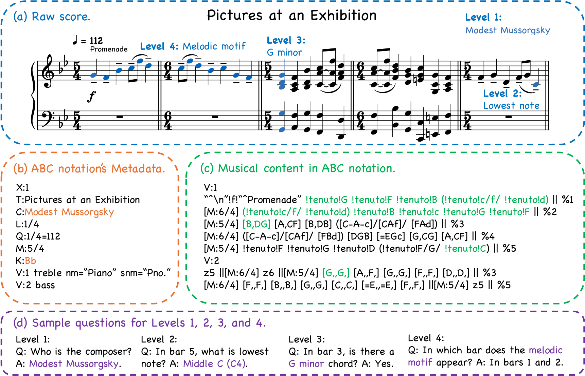
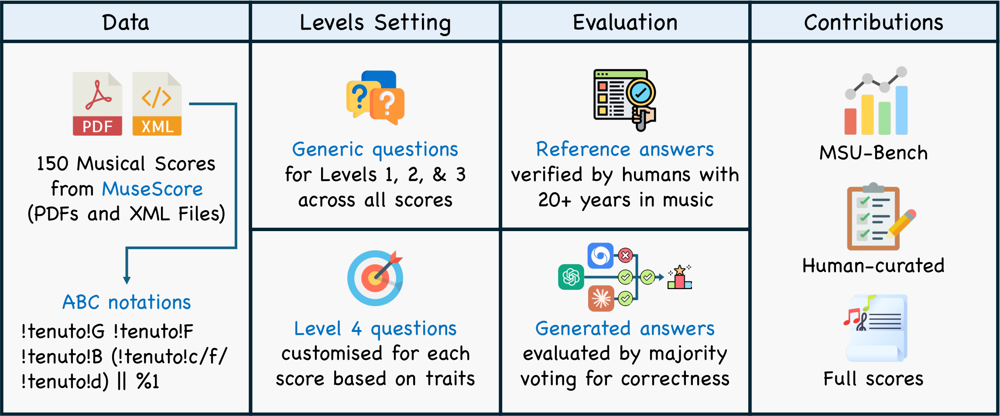

# MSU-Bench: Musical Score Understanding Benchmark

[](https://arxiv.org/abs/2511.20697)

**Evaluating Large Language Models' Comprehension of Complete Musical Scores**

---

## News

- We are glad to share that this work has been accepted to **ACL 2026 Main Conference** 🎉!

## Overview

MSU-Bench is a human-curated benchmark for evaluating the musical score understanding capabilities of Large Language Models (LLMs) and Vision-Language Models (VLMs). It supports multimodal evaluation through both textual (ABC notation) and visual (PDF/image) inputs.

**Key Statistics:**
- 150 complete musical scores
- 1,800 generative question-answer pairs
- 4 hierarchical difficulty levels
- 12 questions per score (3 per level)



## Difficulty Levels

| Level | Focus | Examples |
|-------|-------|----------|
| **Level 1** - Onset Information | Metadata at the beginning of a score | Composer, title, key, time signature, tempo, instrumentation, anacrusis |
| **Level 2** - Notation & Note | Local bar-level notation details | Pitch range, accidentals, dynamics, articulations, ornaments, tempo changes |
| **Level 3** - Chord & Harmony | Harmonic structures and progressions | Chord qualities, inversions, cadences, modulations, pedal points |
| **Level 4** - Texture & Form | Large-scale structural analysis | Melodic motifs, thematic organisation, texture types, formal design |

## Dataset Structure

Each sample contains:
- **ABC notation** — text-based symbolic music representation
- **PDF** — the original rendered score
- **Page images** (PNG) — individual pages of the PDF score
- **Questions** — 12 questions (3 per difficulty level) with reference answers

### Modalities for Evaluation

| Modality | Input | Target Models |
|----------|-------|---------------|
| Textual QA | ABC notation + question | LLMs |
| Visual QA | PDF/images + question | VLMs |

## Repertoire

The benchmark covers 150 scores from the Western art music canon, spanning:
- **Periods:** Baroque, Classical, Romantic, Impressionism, 20th Century
- **Composers:** Bach, Beethoven, Chopin, Brahms, Debussy, Liszt, Schubert, Mozart, Mussorgsky, Grieg, and others
- **Genres:** Sonatas, character pieces, fugues, waltzes, nocturnes, etudes, rhapsodies, symphonies, concertos, art songs

## Usage

### Loading from HuggingFace
coming soon


## Citation

```bibtex
@article{dai2025msubench,
  title={Musical Score Understanding Benchmark: Evaluating Large Language Models' Comprehension of Complete Musical Scores},
  author={Dai, Congren and Yang, Yue and Li, Krinos and Zhou, Huichi and Liang, Shijie and Zhang, Bo and Liu, Enyang and Jin, Ge and An, Hongran and Zhang, Haosen and Jing, Peiyuan and Lee, Kinhei and Zhang, Zhenxuan and Li, Xiaobing and Sun, Maosong},
  journal={arXiv preprint arXiv:2511.20697},
  year={2025}
}
```


## Acknowledgements

This work is supported by the Advanced Discipline Construction Project of Beijing Universities, the Special Programme of National Natural Science Foundation of China (Grant No. T2341003), and the Major Programme of National Social Science Fund of China (Grant No. 21ZD19).
